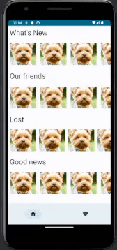

# Sirius Mobile Application
This repository documents the features and technical details of the "Sirius" mobile application. "Sirius" is designed to provide users with a seamless and engaging experience when exploring content related to an animal shelter.

## Contents
1. Project Creation
2. Main Pages
3. Navigation Bar
4. Database Creation
5. Styles and Customization
6. Link to Repository
7. Technical Summary

## Application's GIF

